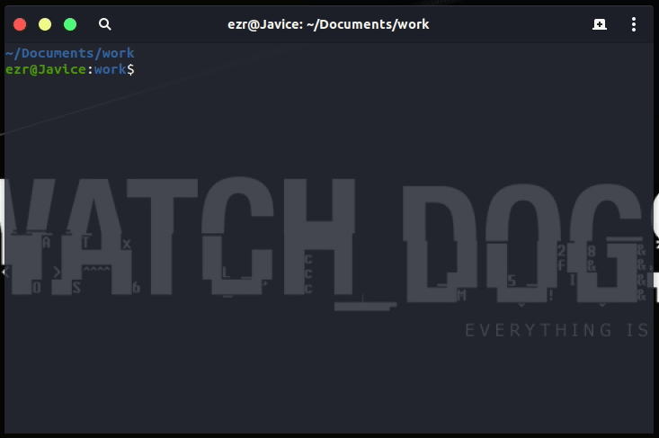
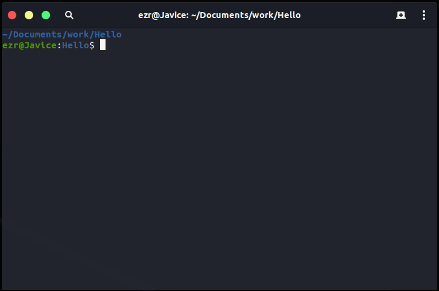
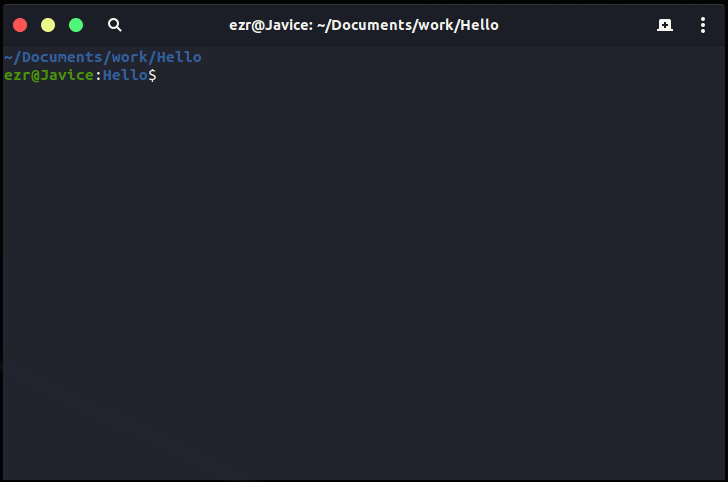

# Alioth Compiler

Alioth Compiler is designed to compile the Alioth programming language.

Current Version 0.3 
Corresponding Language Version 0.9

## Features

- init project workspace structure wherever you want

    this compiler can help you generate subdirectories and building scripts needed.

    
- communicate with environment through standard input and output stream

    this compiler will ask environment for content of which the file it was going to use.

## Development environment

This compiler can be compiled correctly on platform of linux-x86_64 by "g++-8" which is a c++ compiler who supports c++17 standard.

### Obtain the LLVM support

Currently this compiler depends on the LLVM project, run the following commands to setup a development environment with the LLVM library avalible.

~~~bash
#!/bin/bash

#This script is written in 2019, we can't ensure that the necessary steps building an available llvm environment doesn't change at the time you're reading this.

# obtain the source code of the llvm core libraries
wget http://releases.llvm.org/8.0.0/llvm-8.0.0.src.tar.xz
tar -xJf llvm-8.0.0.src.tar.xz
mkdir llvm-8.0.0.src/build
cd llvm-8.0.0.src/build

# turn on options necessary
cmake -DCMAKE_INSTALL_PREFIX=/usr -DLLVM_ENABLE_CXX1Y=ON -DLLVM_ENABLE_EH=ON -DLLVM_ENABLE_RTTI=ON -DLLVM_ENABLE_PEDANTIC=OFF ..

# if possible, compile the llvm libraries through more processes.
make -j

# install the llvm core libraries
sudo make install
~~~

### Obtain the Alex support

The Alex project is a sub-project of the Alioth project which is used to generate lexical parser and the syntax parser, for more information please check the [GitHub repository](https://github.com/dn-ezr/alex).

## Runtime environment

If you just need to run this compiler to compile the alioth programming language, the link editor 'ld' will be the only need of you, fortunately most development environment has this program already installed.

## Command line Interface
All command line parameters can be separated into two set.
The compiler of the Alioth programming language can be started by the command line. You can control the behaviors of the compiler by passing command line parameters.

Here I'll show you some common usage of this compiler, for more information, please view the [Alioth Compiler Manual](doc/Alioth%20Compiler%20Manual.md).

The common command format to compile several modules into a target as follow:

~~~bash
#!/bin/bash

aliothc module1 module2 module3 : target
~~~

Just as the simple as you seeing, `module1 module2 module3` were three assumed names representing three modules, then the colon is a indicator indicates the following string "`target`" is the name of the target of this compiling mission.

You can arrange the order of these four parameters any how you like it. Yes, four parameters, the indicator and the target name are combined to be one single parameter.

If the target you are going to compile will use all modules in the work space you have written, you can leave the module name list blank and let the compiler find all modules available and compile them.

Note that if you miss the entry method in modules or you done it on purpos, compiler will not give you an error, it compiles all modules into a static link library and store it into the `arc` sub space instead.

That's all, enjoy coding, and have fun changing the world ^_^