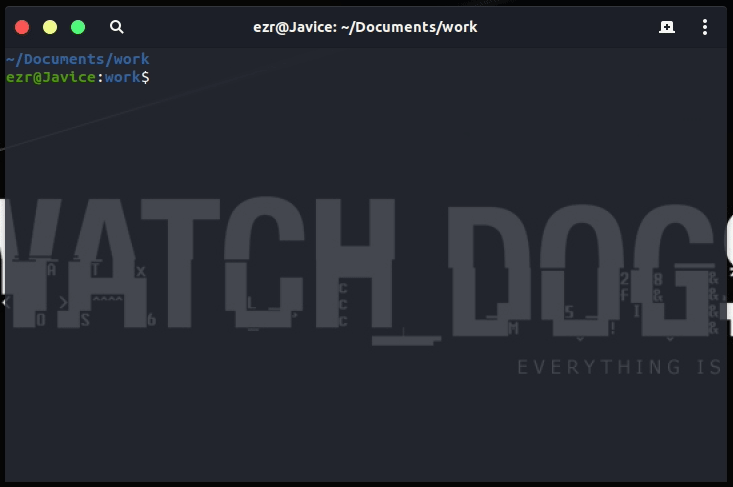

# Alioth Compiler

Alioth Compiler is designed to compile the Alioth Programming language.

Current Version 0.3 
Corresponding Language Version 0.9

## Features

- init project workspace structure wherever you want

    this compiler can help you generate subdirectories and building scripts needed.

    
- communicate with environment through standard input and output stream

    this compiler will ask environment for content of which the file it was going to use.

## Development environment

This compiler can be compiled correctly on platform of linux-x86_64 by "g++-8" which is a c++ compiler who supports c++17 standard.

Currently this compiler depends on the LLVM project, run the following commands to setup a development environment with the LLVM library avalible.

~~~bash
#!/bin/bash

# obtain the source code of the llvm core libraries
wget http://releases.llvm.org/8.0.0/llvm-8.0.0.src.tar.xz
tar -xJf llvm-8.0.0.src.tar.xz
mkdir llvm-8.0.0.src/build
cd llvm-8.0.0.src/build

# turn on options necessary
cmake -DCMAKE_INSTALL_PREFIX=/usr -DLLVM_ENABLE_CXX1Y=ON -DLLVM_ENABLE_EH=ON -DLLVM_ENABLE_RTTI=ON -DLLVM_ENABLE_PEDANTIC=OFF ..

# if possible, compile the llvm libraries through more processes.
make -j

# install the llvm core libraries
sudo make install
~~~

## Runtime environment

If you just need to run this compiler to compile the alioth programming language, the link editor 'ld' will be the only need of you, fortunately most development environment has this program already installed.