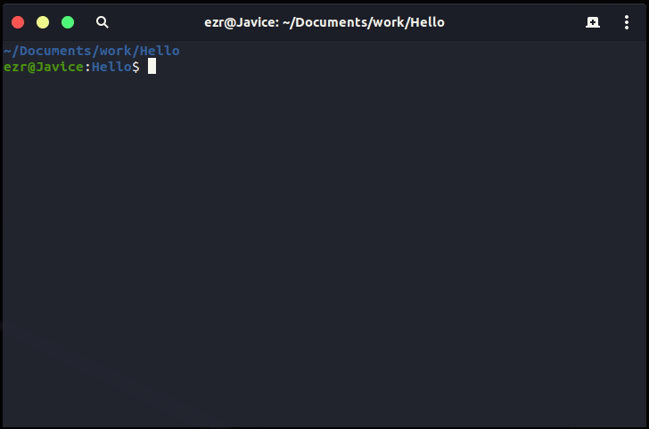
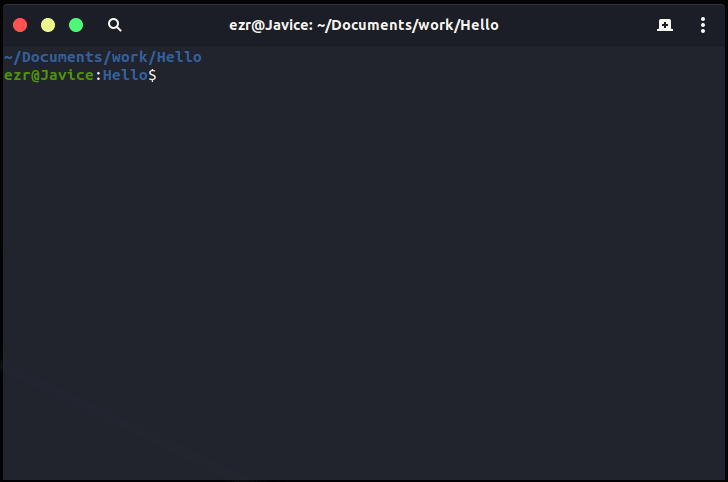

# Alioth Compiler

> If a version in another language is needed, please refer to the [read me in English](README.en.md)

Alioth编译器被设计用于编译Alioth编程语言。

当前版本 0.3 
对应语言版本 0.9

## 特性

- 在你想要的地方初始化项目目录结构

    编译器可帮您生成项目子路径和项目所需的构建脚本。

    
- 通过标准输入输出流与环境交互

    编译器可以与外部环境协商所使用的文档的内容，也可以向外界提供项目的诊断信息，此特性用于向拥有GUI的集成开发环境提供Alioth语法高亮和热语法检查等支持。

## 开发环境

编译器可以在`linux-x86_64`平台上被`g++-8`编译器正确编译，`g++-8`是一款支持`GNU C++17`标准的`C++`编译器。

### 获取LLVM支持

目前，此编译器的开发过程依赖于`LLVM-Core`项目提供的SDK,执行下列指令来建立基于LLVM的开发环境。

~~~bash
#!/bin/bash

#此脚本编辑于2019年，我们无法保证当您正在阅读此脚本时，构建可用的LLVM开发环境所需的必要步骤没有改变。

# 获取LLVM核心库的源码
wget http://releases.llvm.org/8.0.0/llvm-8.0.0.src.tar.xz
tar -xJf llvm-8.0.0.src.tar.xz
mkdir llvm-8.0.0.src/build
cd llvm-8.0.0.src/build

# 打开必要的选项
cmake -DCMAKE_INSTALL_PREFIX=/usr -DLLVM_ENABLE_CXX1Y=ON -DLLVM_ENABLE_EH=ON -DLLVM_ENABLE_RTTI=ON -DLLVM_ENABLE_PEDANTIC=OFF ..

# 如果可以，使用多线程编译LLVM
make -j

# 安装LLVM核心开发库
sudo make install
~~~

### 获取Alex支持

Alex是Alioth项目的子项目，用于从alex文法产生词法分析器和语法分析器，详情请查阅[GitHub仓库](https://github.com/dn-ezr/alex)。

## 运行时环境

如果您只是需要运行此编译器来编译Alioth编程语言，只需要确保`ld`程序可用即可，幸运的是，多数开发环境都预装了此程序。

## 命令行接口

所有的命令行参数被分为两类。

Alioth编译器可以从命令行启动。您可以传入不同的命令行参数来控制编译器的行为。

我会向您展示一些此编译器的常见使用方法，要了解详细使用方法，请参考[Alioth编译器手册](doc/Alioth编译器手册.md)。

将若干模块编译成为一个目标的最常见指令格式如下:

~~~bash
#!/bin/bash

aliothc module1 module2 module3 : target
~~~

如您所见，就是这么简单，`module1 module2 module3`被视为三个模块的名称，接下来的冒号是一个指示器，指示接下来的字符串`target`是本次编译任务的目标的名字。

您可以随意安排这四个命令行参数的顺序。没错，四个参数，指示器和目标名称被联合成为一个参数，他们的顺序不能改变。

如果您正要编译的目标将会使用当前工作空间中您所写的所有模块，您可以不指定模块名表，让编译器找到所有的可用模块，并编译它们。

请注意，如果您漏写了入口方法，或您故意为之，编译器不会给您报告一个错误，而是将所有模块编译到一个静态链接库中，并存储在`arc`子空间中。

就这样，祝您享受编码及改变世界的过程 ^_^