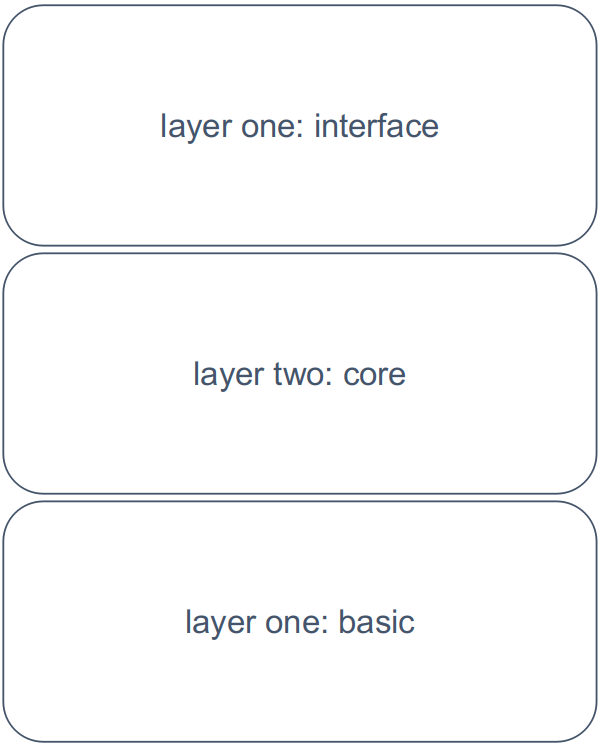

# 1. chapter one : Structure of the Alioth compiler

The Alioth Compiler is well structured. There are three layers for the compiler's abstract entity.

These three layers consists of modules to have the corresponding job done.